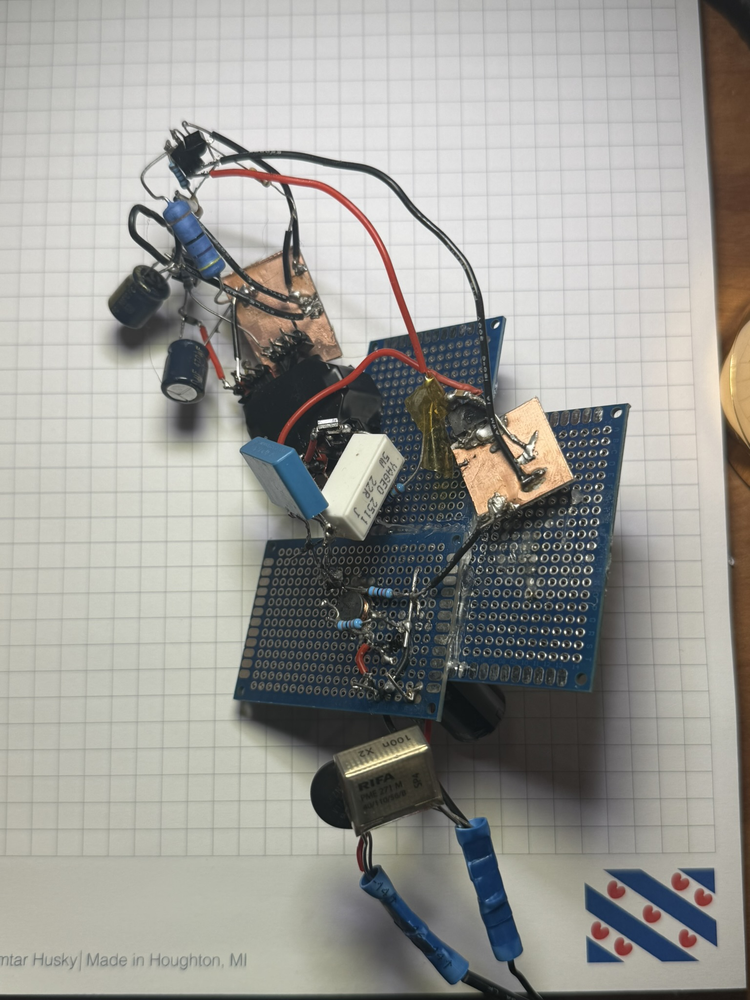
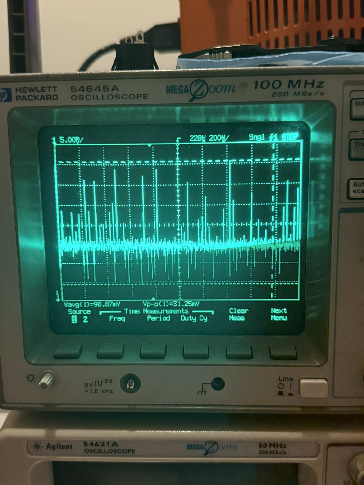
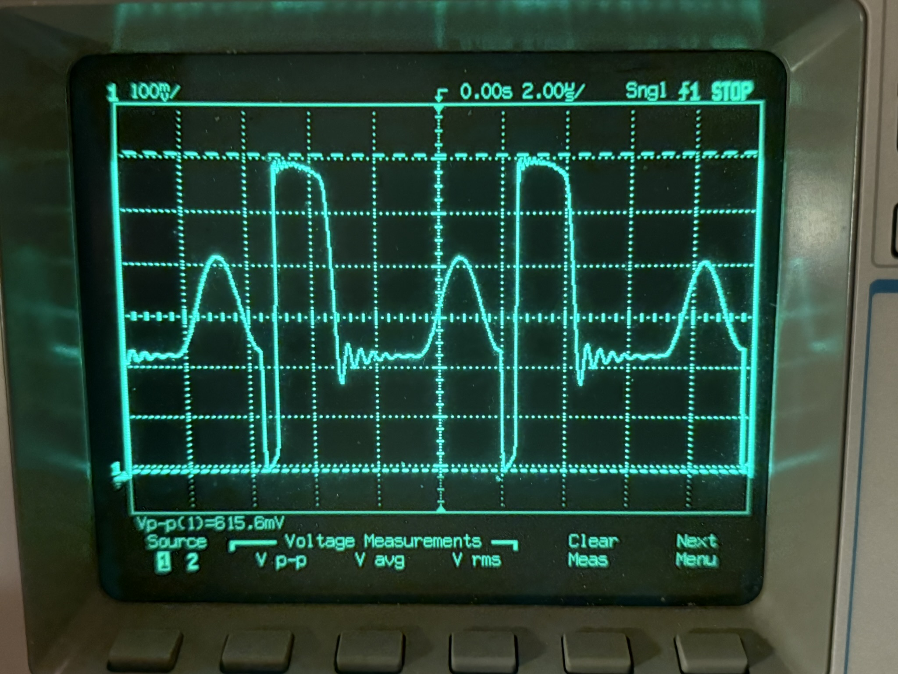

# 5 V 0.5 A Offline Flyback SMPS

Bench-validated 5 V 0.5 A offline flyback switch-mode power supply using a custom hand-wound RM10/I transformer and a Power Integrations TNY285 TinySwitch controller. The transformer is documented as a production-grade prototype component, and the completed hardware package includes the assembled four-layer PCB design. The documented headline result is approximately 494 mA calculated load current.

The transformer was custom programmatically calculated and designed with internally developed software. The detailed design inputs, construction recipe, and calculation tools are retained privately; this public repository presents the resulting system and bench validation at a portfolio-safe level.

This repository is organized for GitHub viewing: CSVs, Markdown, PDFs, and JPG images are first-class. Curated source captures and technical assets are preserved under `archive/` and `Appendix/`.

## Bench Validation Images

### Dead-bug Prototype

### Output Waveform

### Drain Waveform

## Project Highlights

- Designed and hand-wound a production-grade prototype RM10/I flyback transformer
- Completed four-layer PCB design and assembly package for the power stage
- Custom transformer calculated and designed programmatically with internally developed software
- Built and debugged offline flyback prototype from first principles
- Hi-potential tested at the documented approximately 2.0 kVAC / 60 s condition and insulation tested at HV
- Demonstrated half-amp operating point: approximately 4.94 V output across a 10 ohm load with approximately 494 mA calculated load current.
- Additional characterization at 5.6 ohm captured approximately 882 mA calculated load current; this is not a sustained or validated 1 A operating claim.
- Performed transformer insulation and approximately 2.0 kVAC / 60 s HiPot testing as pre-compliance evidence against the applicable insulation and dielectric-strength requirements; this is not certification
- Measured output behavior and drain stress under bench load
- Captured drain waveform behavior and output waveform behavior
- Preserved the original scope captures and curated technical source assets
- Added isolation transformer and Middlebrook injector as first-class tools

## Electrical Summary

| Item | Value |
|---|---:|
| Input | 120 VAC nominal |
| Bulk bus | about 170 VDC |
| Controller | Power Integrations TNY285PG |
| Transformer | Production-grade prototype custom hand-wound RM10/I |
| PCB | Completed four-layer power-stage design and assembly package |
| Half-amp operating load | 10 ohm |
| Bench output at half-amp point | about 4.94 V |
| Calculated load current | about 494 mA from measured 4.94 V / 10 ohm |
| Additional characterization | 5.6 ohm; about 882 mA calculated |
| Stepped load sequence | 47 ohm -> 10 ohm -> 5.6 ohm; approximately 105 mA -> 494 mA -> 882 mA at 4.94 V |
| Peak drain voltage observed | about 344 V max |
| Insulation / dielectric testing | Transformer insulation review and approximately 1.5 kVAC / 60 s HiPot pre-compliance evidence; not certification |

## Measured versus calculated

The approximately 4.94 V value is the measured scope result. Each load current is calculated from V/R. The 10 ohm condition is the demonstrated half-amp operating point. The 5.6 ohm condition is additional load characterization at approximately 882 mA calculated current, not a claim of certified, sustained, or validated 1 A operation.

## Viewable Asset Indexes

- [CSV file index](docs/csv_exports_index.md)
- [Image index](docs/image_index.md)
- [Full file index](docs/full_file_index.md)
- [Digi-Key load evidence](docs/purchase-evidence/digikey_load_resistors.md)

## Repository Structure

- `hardware/` - schematic, BOM CSVs, PCB images, and system hardware files
- `validation/` - dead-bug photos, output captures, drain waveforms, and measurement CSVs
- `tools/` - isolation transformer, Middlebrook injector, and supporting scripts
- `docs/` - notes, purchase evidence, and indexes
- `archive/` - curated original scope captures

## Spreadsheet Format

Public folders use CSV files as the spreadsheet format because CSVs are browser-viewable, searchable, diffable, and lightweight on GitHub. Public spreadsheets are exported as CSV for browser viewing; source design assets are curated under `Appendix/`.

## Safety Notice

This project involves offline mains voltage and isolated switch-mode power supply design. The files are provided for portfolio and educational documentation only. Mains-powered circuits can be lethal. Use proper isolation, fusing, grounding, probing technique, and supervision where appropriate.
